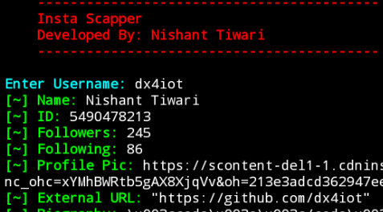

# insta-scraper

A Instagram scraper written in Python that scrap (insta ID, Followers, Following, etc) 

# How to install

# For Termux
    pkg install git
    pkg install python
    git clone https://github.com/dx4iot/insta-scraper.git
    pip install requests 
    pip install bs4 
    cd insta-scraper 
    python instainfo.py

# For Linux
    sudo apt install git
    git clone https://github.com/dx4iot/insta-scraper.git
    pip install requests 
    pip install bs4 
    cd insta-scraper 
    python instainfo.py

## Screenshot

## Contact Me

  Mail: dx4iot@gmail.com

  Instagram: https://www.instagram.com/dx4iot/

  LinkedIn: https://www.linkedin.com/in/dx4iot

  Facebook: https://www.facebook.com/dx4iot/
